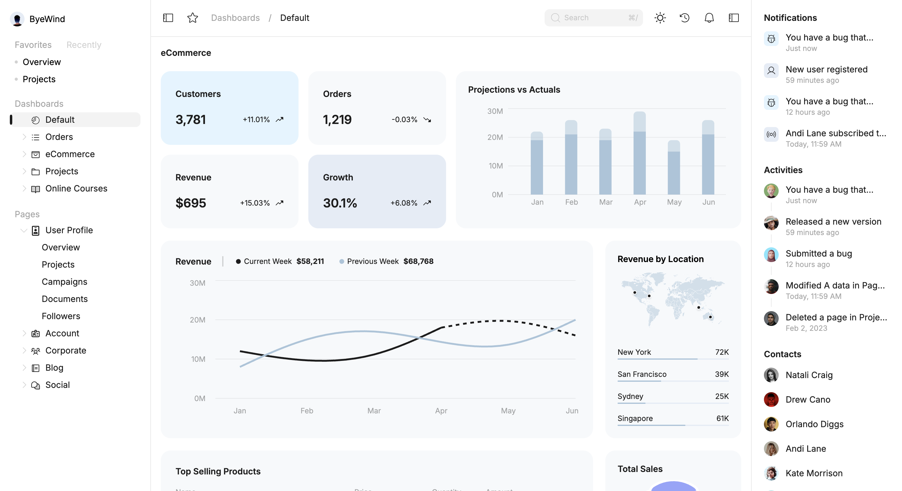
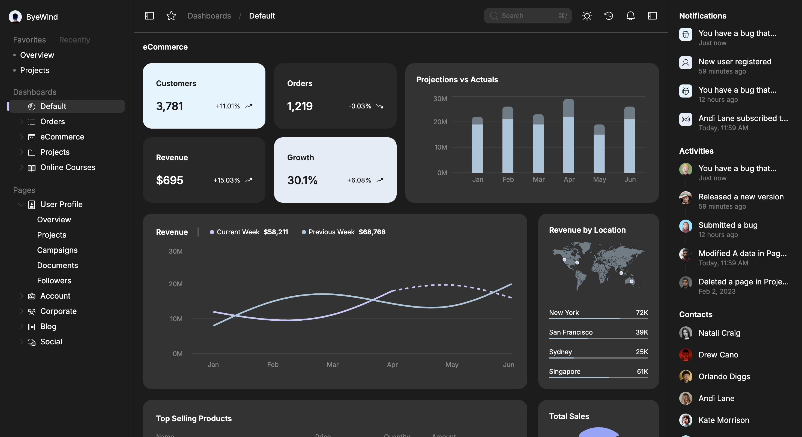
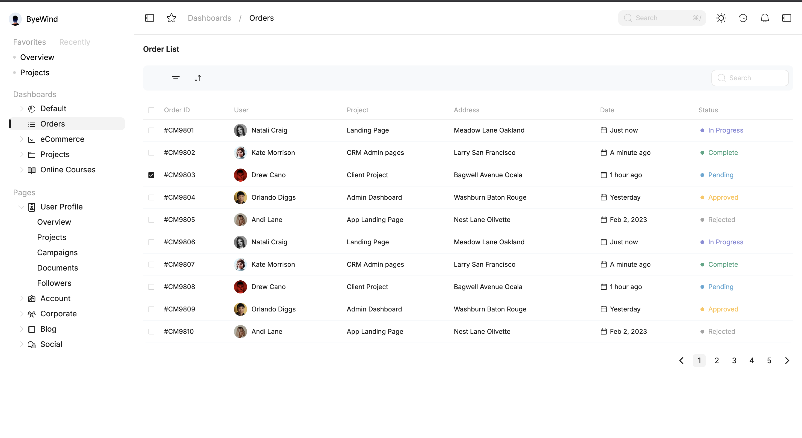
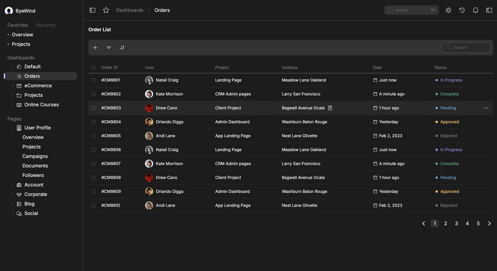

🏷️ Interactive Dashboard – ByeWind

A responsive and interactive ReactJS dashboard application built with modern frontend technologies.
This project demonstrates:

E-commerce metrics & sales reports

Interactive revenue charts

Top-selling products listing

Functional order management table

Real-time notifications

Designed to provide a clean, responsive, and user-friendly interface with both light and dark themes.

🚀 Live Demo

👉 Click here to view live demo

📱 Screenshots
Dashboard – Light & Dark
Light Mode	Dark Mode
	
Orders Page – Light & Dark
Light Mode	Dark Mode
	
✅ Features

Light/Dark Theme Toggle with state persistence

Responsive Layout across desktop, tablet, and mobile

Redux Toolkit State Management for theme, filters, and orders

Charts with Recharts (Bar, Line, Pie)

Order Table with search, filter, sort, pagination & bulk actions

Notifications via toast alerts

Skeleton Loaders & Animations for better UX

Accessible & Optimized with semantic HTML, ARIA roles, and lazy loading

🛠 Tech Stack
Category	Technology
Framework	React (Vite)
State Management	Redux Toolkit
Routing	React Router
Styling	Tailwind CSS
Charts	Recharts
Icons	React Icons
Notifications	React Toastify
Date Handling	Moment.js
Deployment	Vercel / Netlify
📦 Installation & Setup
# Clone the repo
git clone https://github.com/yourusername/byewind-dashboard.git
cd byewind-dashboard

# Install dependencies
npm install

# Run development server
npm run dev

# Build for production
npm run build

# Preview production build
npm run preview

📁 Project Structure
src/
├─ assets/          # Images, icons, fonts
├─ components/      # Reusable UI components
│  ├─ Ecommerce/    # Dashboard components (Metrics, Charts, Sales, Products)
│  ├─ Header/       # App header
│  ├─ Layout/       # App layout
│  ├─ LeftSideBar/  # Sidebar navigation
│  ├─ Order/        # Order list & table
│  ├─ PageNotFound/ # 404 page
│  └─ RightSideBar/ # Notifications, Contacts, Activities
├─ store/           # Redux store & slices
├─ utils/           # Helper functions & mock data
├─ App.jsx          # Main app component
└─ main.jsx         # Entry point